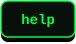
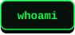
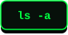
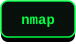
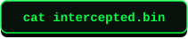
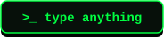

<!--
  you're reading the source. good instinct.
  aWYgeW91IGRlY29kZWQgdGhpcywgd2Ugc2hvdWxkIHRhbGsu
-->

<div align="center">




## `// void — a public shell`

<a href="https://adityainnovates.github.io/AdityaInnovates/"></a>
<a href="https://adityainnovates.github.io/AdityaInnovates/?run=scan"></a>

<sub>A real shell in your browser. <b>scan</b> shows everything your device gives away to every site you visit, and how to lock it down.<br>Runs 100% locally. Nothing you type or scan is sent anywhere.</sub>

<br><br>

<a href="https://adityainnovates.github.io/AdityaInnovates/"></a>

<sub>↑ recent sessions from visitors. Or run a command right here on GitHub: press a key → submit the issue → a bot replies.</sub>

<a href="https://github.com/AdityaInnovates/AdityaInnovates/issues/new?title=term%3A%20help&body=Just%20press%20%2A%2ASubmit%20new%20issue%2A%2A.%20Keep%20the%20%60term%3A%60%20prefix%20in%20the%20title.%0A%0AA%20bot%20runs%20your%20command%2C%20replies%20here%2C%20and%20puts%20your%20anonymised%20session%20on%20the%20profile."></a> <a href="https://github.com/AdityaInnovates/AdityaInnovates/issues/new?title=term%3A%20whoami&body=Just%20press%20%2A%2ASubmit%20new%20issue%2A%2A.%20Keep%20the%20%60term%3A%60%20prefix%20in%20the%20title.%0A%0AA%20bot%20runs%20your%20command%2C%20replies%20here%2C%20and%20puts%20your%20anonymised%20session%20on%20the%20profile."></a> <a href="https://github.com/AdityaInnovates/AdityaInnovates/issues/new?title=term%3A%20ls&body=Just%20press%20%2A%2ASubmit%20new%20issue%2A%2A.%20Keep%20the%20%60term%3A%60%20prefix%20in%20the%20title.%0A%0AA%20bot%20runs%20your%20command%2C%20replies%20here%2C%20and%20puts%20your%20anonymised%20session%20on%20the%20profile."></a> <a href="https://github.com/AdityaInnovates/AdityaInnovates/issues/new?title=term%3A%20nmap&body=Just%20press%20%2A%2ASubmit%20new%20issue%2A%2A.%20Keep%20the%20%60term%3A%60%20prefix%20in%20the%20title.%0A%0AA%20bot%20runs%20your%20command%2C%20replies%20here%2C%20and%20puts%20your%20anonymised%20session%20on%20the%20profile."></a> <a href="https://github.com/AdityaInnovates/AdityaInnovates/issues/new?title=term%3A%20fortune&body=Just%20press%20%2A%2ASubmit%20new%20issue%2A%2A.%20Keep%20the%20%60term%3A%60%20prefix%20in%20the%20title.%0A%0AA%20bot%20runs%20your%20command%2C%20replies%20here%2C%20and%20puts%20your%20anonymised%20session%20on%20the%20profile."></a>

<a href="https://github.com/AdityaInnovates/AdityaInnovates/issues/new?title=term%3A%20cat%20intercepted.bin&body=Just%20press%20%2A%2ASubmit%20new%20issue%2A%2A.%20Keep%20the%20%60term%3A%60%20prefix%20in%20the%20title.%0A%0AA%20bot%20runs%20your%20command%2C%20replies%20here%2C%20and%20puts%20your%20anonymised%20session%20on%20the%20profile."></a> <a href="https://github.com/AdityaInnovates/AdityaInnovates/issues/new?title=term%3A%20decrypt%20PASTE-YOUR-PROOF-HASH&body=Never%20post%20the%20flag%20itself%3A%20issues%20are%20public.%20Paste%20a%20proof%20hash%20bound%20to%20your%20username%20instead%3A%0A%0A%60%60%60bash%0AF%3D%24%28printf%20%25s%20%22flag%7B...%7D%22%20%7C%20sha256sum%20%7C%20cut%20-d%22%20%22%20-f1%29%3B%20printf%20%25s%20%22%24F%3Ayour-github-username%22%20%7C%20sha256sum%0A%60%60%60%0A%0APut%20the%20hash%20in%20the%20title%20after%20%60term%3A%20decrypt%60%20and%20submit."></a> <a href="https://github.com/AdityaInnovates/AdityaInnovates/issues/new?title=term%3A%20sudo%20su&body=Just%20press%20%2A%2ASubmit%20new%20issue%2A%2A.%20Keep%20the%20%60term%3A%60%20prefix%20in%20the%20title.%0A%0AA%20bot%20runs%20your%20command%2C%20replies%20here%2C%20and%20puts%20your%20anonymised%20session%20on%20the%20profile."></a>

<a href="https://github.com/AdityaInnovates/AdityaInnovates/issues/new?title=term%3A%20&body=Type%20any%20command%20after%20%60term%3A%60%20in%20the%20title%20and%20submit.%20Start%20with%20%60help%60."></a>


## `// intercepted.bin`

</div>

```console
root@void:~# cat intercepted.bin
NzM3OTZlNzQ3YjY1MzE2MTc0NWYzMDVmMzE2NjVmNmE3NTMzNjUzMzVmMzE1Zjc5MzE2OTMzN2Q=
```

Three layers. Peel them. Stuck? Run `hint 1`, `hint 2`, `hint 3` in the shell.<br>
Cracked it? **Don't post the flag.** Issues are public. Prove it without revealing it:

```bash
F=$(printf %s "flag{...}" | sha256sum | cut -d" " -f1); printf %s "$F:your-github-username" | sha256sum
```

Then press <b>decrypt</b> and paste the hash. It's bound to your username, so nobody can copy it.

<!--HALL:START-->
```console
$ cat /var/log/hall_of_shadows
#1   ghost_18bc   2026-09-28
```
<!--HALL:END-->

<div align="center">


## `// arsenal`


<sub>cover identity ↓</sub><br>


## `// telemetry`


## `// open a channel`

<a href="https://www.linkedin.com/in/adityaInnovates/"></a>
<a href="https://www.instagram.com/aditya_innovates"></a>
<a href="https://holopin.io/@adityainnovates"></a>
<a href="https://www.buymeacoffee.com/itzaditya"></a>

<br><br>
<sub><code>[ session terminated · no logs kept · 誰でもない ]</code></sub>

</div>
